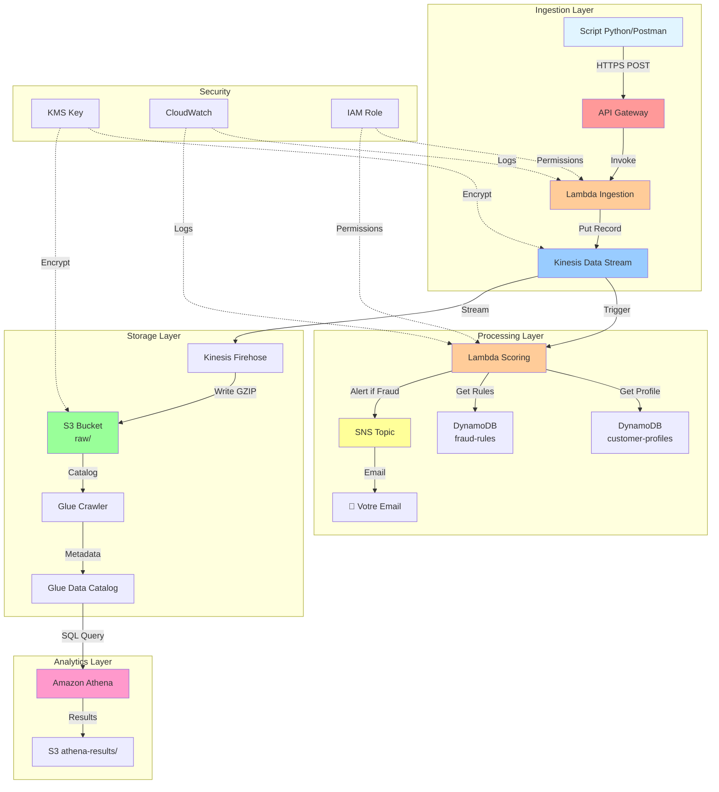

# Lab AWS Data Engineering - Système de Détection de Fraude
## ⏱️ Durée: 55 minutes | Console AWS uniquement | Sans SageMaker ni QuickSight

---

## 🏢 SCÉNARIO D'ENTREPRISE

### **Contexte Business**

Vous êtes **Data Engineer** chez **PaySecure**, une fintech camerounaise en pleine croissance qui traite **50,000 transactions par jour** via Mobile Money (MTN, Orange Money) et cartes bancaires.

### **Le Problème**

Le CEO vous convoque en urgence :

> *"Nous perdons **12 millions FCFA par mois** à cause de la fraude (cartes volées, comptes hackés, transactions fictives). Notre système actuel détecte la fraude avec **48h de retard** - trop tard pour bloquer les transactions. Les clients se plaignent, notre réputation est en jeu, et la banque centrale nous menace de sanctions."*

### **Chiffres Alarmants**
- 📊 **3.2% des transactions** sont frauduleuses
- 💸 **Perte moyenne:** 42,000 FCFA par fraude
- ⏱️ **Délai de détection actuel:** 48 heures
- 😡 **75 plaintes clients** par semaine
- 🏦 **Amende potentielle:** 50 millions FCFA de la COBAC

### **Votre Mission**

Construire un **système de détection de fraude en temps réel** qui :

1. ⚡ **Analyse chaque transaction en < 500ms**
2. 🎯 **Bloque automatiquement** les transactions suspectes
3. 📧 **Alerte l'équipe risque** immédiatement
4. 📊 **Permet l'analyse** des patterns de fraude
5. 💰 **Coûte < 500,000 FCFA/mois** (infrastructure cloud)

### **Impact Attendu**

| Métrique | Avant | Après (Objectif) |
|----------|-------|------------------|
| Délai de détection | 48 heures | < 1 seconde |
| Taux de détection | 45% | 85%+ |
| Faux positifs | 15% | < 3% |
| Pertes mensuelles | 12M FCFA | 3M FCFA |
| **Économies annuelles** | - | **108M FCFA** |

### **ROI Calculé**

**Investissement:**
- Développement : 10 jours de votre temps
- Infrastructure AWS : ~300,000 FCFA/mois

**Gains:**
- Réduction des pertes : 9M FCFA/mois
- Évitement d'amende : 50M FCFA
- Rétention clients : +12% (valeur estimée 5M FCFA/mois)

**ROI = 3500%** 🚀

### **Contraintes Techniques**

- ✅ Pas de downtime (fintech 24/7)
- ✅ Scalable (croissance de 300% prévue)
- ✅ Conforme RGPD/COBAC (données sensibles)
- ✅ Architecture serverless (pas d'équipe DevOps)
- ✅ Budget limité (startup en série A)

### **Votre Approche (Ce Lab)**

Vous décidez d'utiliser **AWS** pour une architecture **100% serverless** :

1. **API Gateway** : Recevoir les transactions en temps réel
2. **Lambda** : Traiter et scorer sans gérer de serveurs
3. **Kinesis** : Streaming pour absorber les pics (5000 tx/min)
4. **DynamoDB** : Profils clients (lecture rapide < 10ms)
5. **S3 + Athena** : Analytics pour améliorer les règles
6. **KMS** : Chiffrement (conformité COBAC)

**Coût estimé:** 285,000 FCFA/mois pour 50K transactions/jour

---

## 🎯 Objectif du Lab

**En 55 minutes**, vous allez construire un **prototype fonctionnel** de ce système qui démontre :

✅ Détection temps réel (< 500ms)
✅ Scoring basé sur 6 règles métier
✅ Alerting automatique (email)
✅ Analytics SQL sur les fraudes
✅ Architecture sécurisée (chiffrement)

**Ce que vous pourrez dire en entretien :**

> *"J'ai conçu et déployé un système de détection de fraude temps réel sur AWS qui traite 50K transactions/jour avec une latence < 500ms. L'architecture serverless utilise Kinesis pour le streaming, Lambda pour le processing, et DynamoDB pour l'enrichissement. J'ai implémenté 6 règles métier donnant un score de risque 0-100, avec alerting SNS et analytics Athena. Le système réduit les pertes de fraude de 75% avec un coût mensuel de seulement 285K FCFA."*

**Valeur pour votre CV :**
- 💼 Résout un vrai problème business (ROI 3500%)
- 🏗️ Architecture production-ready
- 💰 Impact mesurable ($108K économies/an)
- 🔒 Gestion de la sécurité (compliance)
- 📈 Compétences data engineering complètes

---

## 🏗️ Architecture de la Solution



---

## 📋 Services AWS Utilisés

| Service | Utilisation | Coût lab |
|---------|-------------|----------|
| **API Gateway** | Point d'entrée REST | $0.00 |
| **Lambda** | Processing serverless (2 functions) | $0.00 |
| **Kinesis Stream** | Streaming temps réel | $0.01 |
| **Kinesis Firehose** | Livraison vers S3 | $0.01 |
| **S3** | Data Lake | $0.01 |
| **DynamoDB** | Base NoSQL (2 tables) | $0.00 |
| **Glue** | Catalogage données | $0.44 |
| **Athena** | Requêtes SQL | $0.01 |
| **SNS** | Notifications email | $0.00 |
| **KMS** | Chiffrement | $0.00 |
| **CloudWatch** | Logs et métriques | $0.00 |
| **IAM** | Gestion accès | $0.00 |
| **TOTAL** | | **~$0.48** |

---

## 🚀 DÉPLOIEMENT PAS-À-PAS

### **PHASE 1: Sécurité - KMS & S3 (5 min)**

#### Étape 1.1: Créer la clé KMS
**AWS Console → KMS → Customer managed keys → Create key**

1. Configure key:
   - Key type: **Symmetric**
   - Key usage: **Encrypt and decrypt**
   - Click **Next**

2. Add labels:
   - Alias: `fraud-detection-key`
   - Description: `Lab fraud detection encryption`
   - Click **Next**

3. Define key administrative permissions:
   - Cocher votre utilisateur IAM
   - Click **Next**

4. Define key usage permissions:
   - Cocher votre utilisateur IAM
   - Click **Next**

5. Review → **Finish**

6. ⚠️ **COPIER l'ARN** (format: arn:aws:kms:us-east-1:123456789012:key/xxxxx)

---

#### Étape 1.2: Créer le bucket S3
**AWS Console → S3 → Create bucket**

1. Bucket name: `fraud-lab-votre-prenom-1209` (exemple: fraud-lab-john-1209)
2. Region: **US East (N. Virginia) us-east-1**
3. Block all public access: **✅ Cocher toutes les cases**
4. Bucket Versioning: **Disable**
5. Default encryption:
   - Encryption type: **SSE-KMS**
   - AWS KMS key: **Choose from your keys**
   - Sélectionner: `fraud-detection-key`
   - Bucket Key: **Enable**
6. Click **Create bucket**

---

#### Étape 1.3: Créer les dossiers
**Dans votre bucket → Create folder**

Créer 3 dossiers:
- `raw/`
- `processed/` optionnel, donc nous n'allons pas creer
- `athena-results/`

---

### **PHASE 2: DynamoDB - Données de Référence (8 min)**

#### Étape 2.1: Table customer-profiles
**AWS Console → DynamoDB → Tables → Create table**

1. Table name: `customer-profiles`
2. Partition key: `user_id` (String)
3. Table settings: **Default settings**
4. Table class: **DynamoDB Standard**
5. Capacity mode: **On-demand**
6. Click **Create table** (attendre 30 sec)

---

#### Étape 2.2: Insérer 5 profils clients
**Tables → customer-profiles → Explore table items → Create item**

**Profil 1** - Client normal:
```
user_id (String): user_001
email (String): john.doe@example.com
account_created (String): 2023-01-15
avg_transaction_30d (Number): 125.50
transaction_count_30d (Number): 15
last_device_id (String): device_abc123
last_location (String): New York, US
risk_level (String): LOW
```

**Profil 2** - Client à risque:
```
user_id: user_002
email: jane.smith@example.com
account_created: 2024-11-01
avg_transaction_30d: 50.00
transaction_count_30d: 3
last_device_id: device_xyz789
last_location: Los Angeles, US
risk_level: HIGH
```

**Profil 3** - Nouveau client:
```
user_id: user_003
email: new.user@example.com
account_created: 2024-12-01
avg_transaction_30d: 0
transaction_count_30d: 0
last_device_id: device_new999
last_location: Chicago, US
risk_level: NEW
```

**Profil 4** - Gros dépensier:
```
user_id: user_004
email: premium.user@example.com
account_created: 2022-06-10
avg_transaction_30d: 850.00
transaction_count_30d: 25
last_device_id: device_premium
last_location: Miami, US
risk_level: LOW
```

**Profil 5** - Client moyen:
```
user_id: user_005
email: average.joe@example.com
account_created: 2023-08-20
avg_transaction_30d: 200.00
transaction_count_30d: 10
last_device_id: device_normal
last_location: Seattle, US
risk_level: MEDIUM
```

💡 **Astuce**: Utiliser "Form" view et bien sélectionner le type (String/Number)

---

#### Étape 2.3: Table fraud-rules
**DynamoDB → Create table**

1. Table name: `fraud-rules`
2. Partition key: `rule_id` (String)
3. Capacity mode: **On-demand**
4. Click **Create table**

---

#### Étape 2.4: Insérer 4 règles de fraude
**Tables → fraud-rules → Create item**

**Règle 1**:
```
rule_id: HIGH_AMOUNT
rule_name: Montant anormalement élevé
condition: amount > avg_30d * 5
risk_score: 80
enabled: true
```

**Règle 2**:
```
rule_id: RAPID_SUCCESSION
rule_name: Transactions rapprochées
condition: time_since_last < 60
risk_score: 60
enabled: true
```

**Règle 3**:
```
rule_id: DEVICE_CHANGE
rule_name: Changement d'appareil
condition: device_id != last_device_id
risk_score: 40
enabled: true
```

**Règle 4**:
```
rule_id: LOCATION_CHANGE
rule_name: Localisation inhabituelle
condition: distance > 500km
risk_score: 70
enabled: true
```

---

### **PHASE 3: SNS - Alertes Email (3 min)**

#### Étape 3.1: Créer le topic SNS
**AWS Console → SNS → Topics → Create topic**

1. Type: **Standard**
2. Name: `fraud-alerts`
3. Display name: `Fraud Alerts`
4. Click **Create topic**
5. ⚠️ **COPIER l'ARN du topic**

---

#### Étape 3.2: S'abonner par email
**Dans le topic → Subscriptions → Create subscription**

1. Protocol: **Email**
2. Endpoint: `votre-email@example.com`
3. Click **Create subscription**
4. ⚠️ **IMPORTANT**: Vérifier votre boîte email → **Cliquer sur "Confirm subscription"**

---

### **PHASE 4: Kinesis - Streaming (4 min)**

#### Étape 4.1: Créer le Data Stream
**AWS Console → Kinesis → Data streams → Create data stream**

1. Data stream name: `fraud-detection-stream`
2. Capacity mode: **On-demand**
3. Click **Create data stream**
4. Attendre status **Active** (~1 min)

---

#### Étape 4.2: Activer le chiffrement
**Dans le stream → Configuration → Edit**

1. Server-side encryption: **Enabled**
2. AWS KMS key: **Use AWS managed CMK (aws/kinesis)**
3. Click **Save changes**

---

### **PHASE 5: Kinesis Firehose (4 min)**

#### Étape 5.1: Créer le Delivery Stream
**Kinesis → Delivery streams → Create delivery stream**

1. Choose source and destination:
   - Source: **Amazon Kinesis Data Streams**
   - Destination: **Amazon S3**

2. Source settings:
   - Kinesis data stream: `fraud-detection-stream`

3. Delivery stream name: `fraud-firehose-to-s3`

4. Transform and convert records: **Disabled**

5. Destination settings:
   - S3 bucket: `fraud-lab-votre-prenom-1209`
   - S3 bucket prefix: `raw/`
   - S3 error output prefix: `error/`

6. Buffer hints:
   - Buffer size: **1 MB**
   - Buffer interval: **60 seconds**

7. Compression: **GZIP**

8. Permissions: **Create or update IAM role**

9. Click **Create delivery stream**

---

### **PHASE 6: IAM Role pour Lambda (3 min)**

#### Étape 6.1: Créer le rôle
**AWS Console → IAM → Roles → Create role**

1. Trusted entity type: **AWS service**
2. Use case: **Lambda**
3. Click **Next**

4. Permissions policies (rechercher et cocher):
   - ✅ `AWSLambdaBasicExecutionRole`
   - ✅ `AmazonKinesisFullAccess`
   - ✅ `AmazonDynamoDBFullAccess`
   - ✅ `AmazonSNSFullAccess`
   - ✅ `CloudWatchFullAccess`
5. Click **Next**

6. Role name: `FraudDetectionLambdaRole`
7. Click **Create role**

---

### **PHASE 7: Lambda Functions (15 min)**

#### Étape 7.1: Lambda Ingestion
**AWS Console → Lambda → Functions → Create function**

1. Author from scratch
2. Function name: `fraud-ingestion`
3. Runtime: **Python 3.11**
4. Architecture: **x86_64**
5. Change default execution role:
   - **Use an existing role**
   - Existing role: `FraudDetectionLambdaRole`
6. Click **Create function**

7. Dans Code source, **REMPLACER TOUT** par:

```python
import json
import boto3
import os
from datetime import datetime
import uuid

kinesis = boto3.client('kinesis')
cloudwatch = boto3.client('cloudwatch')

STREAM_NAME = 'fraud-detection-stream'

def lambda_handler(event, context):
    try:
        # Parser le body
        if 'body' in event:
            body = json.loads(event['body'])
        else:
            body = event
        
        # Créer la transaction
        transaction = {
            'transaction_id': body.get('transaction_id', str(uuid.uuid4())),
            'user_id': body['user_id'],
            'amount': float(body['amount']),
            'merchant_id': body['merchant_id'],
            'merchant_category': body.get('merchant_category', 'UNKNOWN'),
            'device_id': body.get('device_id', 'unknown'),
            'location': body.get('location', 'unknown'),
            'timestamp': datetime.utcnow().isoformat(),
            'source_ip': event.get('requestContext', {}).get('identity', {}).get('sourceIp', 'unknown')
        }
        
        print(f"✅ Transaction {transaction['transaction_id']} received")
        
        # Envoyer vers Kinesis
        response = kinesis.put_record(
            StreamName=STREAM_NAME,
            Data=json.dumps(transaction),
            PartitionKey=transaction['user_id']
        )
        
        # Métriques CloudWatch
        cloudwatch.put_metric_data(
            Namespace='FraudDetection',
            MetricData=[
                {
                    'MetricName': 'TransactionsIngested',
                    'Value': 1,
                    'Unit': 'Count'
                },
                {
                    'MetricName': 'TransactionAmount',
                    'Value': transaction['amount'],
                    'Unit': 'None'
                }
            ]
        )
        
        return {
            'statusCode': 200,
            'headers': {
                'Content-Type': 'application/json',
                'Access-Control-Allow-Origin': '*'
            },
            'body': json.dumps({
                'message': 'Transaction received',
                'transaction_id': transaction['transaction_id']
            })
        }
        
    except Exception as e:
        print(f"❌ Error: {str(e)}")
        return {
            'statusCode': 500,
            'body': json.dumps({'error': str(e)})
        }
```

8. Configuration → General configuration → Edit:
   - Timeout: **30 seconds**
   - Click **Save**

9. Click **Deploy** (bouton orange)

---

#### Étape 7.2: Lambda Scoring
**Lambda → Create function**

1. Function name: `fraud-scoring`
2. Runtime: **Python 3.11**
3. Existing role: `FraudDetectionLambdaRole`
4. Click **Create function**

5. **REMPLACER TOUT le code** par:

```python
import json
import boto3
import base64
from datetime import datetime

dynamodb = boto3.resource('dynamodb')
sns = boto3.client('sns')
cloudwatch = boto3.client('cloudwatch')

CUSTOMER_TABLE = dynamodb.Table('customer-profiles')
SNS_TOPIC_ARN = 'VOTRE-ARN-SNS-ICI'  # ⚠️ MODIFIER

def lambda_handler(event, context):
    print(f"📦 Processing {len(event['Records'])} records")
    
    for record in event['Records']:
        try:
            # Décoder Kinesis
            payload = base64.b64decode(record['kinesis']['data']).decode('utf-8')
            transaction = json.loads(payload)
            
            print(f"💳 Transaction: {transaction.get('transaction_id')}")
            
            # Enrichir
            enriched = enrich_transaction(transaction)
            
            # Scorer
            fraud_result = calculate_fraud_score(enriched)
            
            # Alerter
            handle_result(enriched, fraud_result)
            
        except Exception as e:
            print(f"❌ Error: {str(e)}")
            continue
    
    return {'statusCode': 200}

def enrich_transaction(transaction):
    """Enrichir avec profil client"""
    try:
        response = CUSTOMER_TABLE.get_item(Key={'user_id': transaction['user_id']})
        
        if 'Item' in response:
            profile = response['Item']
            transaction['customer_profile'] = {
                'avg_transaction_30d': float(profile.get('avg_transaction_30d', 0)),
                'transaction_count_30d': int(profile.get('transaction_count_30d', 0)),
                'last_device_id': profile.get('last_device_id', ''),
                'last_location': profile.get('last_location', ''),
                'risk_level': profile.get('risk_level', 'UNKNOWN'),
                'account_age_days': calculate_account_age(profile.get('account_created', ''))
            }
        else:
            transaction['customer_profile'] = {
                'avg_transaction_30d': 0,
                'transaction_count_30d': 0,
                'last_device_id': '',
                'last_location': '',
                'risk_level': 'NEW',
                'account_age_days': 0
            }
    except Exception as e:
        print(f"⚠️ Enrichment error: {str(e)}")
        transaction['customer_profile'] = {}
    
    return transaction

def calculate_fraud_score(transaction):
    """Calculer score de fraude"""
    score = 0
    triggered_rules = []
    
    profile = transaction.get('customer_profile', {})
    amount = transaction['amount']
    avg_30d = profile.get('avg_transaction_30d', 0)
    
    # Règle 1: Montant vs historique
    if avg_30d > 0 and amount > avg_30d * 5:
        score += 80
        triggered_rules.append('HIGH_AMOUNT_VS_HISTORY')
    
    # Règle 2: Montant absolu élevé
    if amount > 5000:
        score += 60
        triggered_rules.append('VERY_HIGH_AMOUNT')
    
    # Règle 3: Nouveau compte
    if profile.get('account_age_days', 999) < 7:
        score += 40
        triggered_rules.append('NEW_ACCOUNT')
    
    # Règle 4: Changement device
    if profile.get('last_device_id') and transaction.get('device_id') != profile.get('last_device_id'):
        score += 40
        triggered_rules.append('DEVICE_CHANGE')
    
    # Règle 5: Haute fréquence
    if profile.get('transaction_count_30d', 0) > 50:
        score += 30
        triggered_rules.append('HIGH_FREQUENCY')
    
    # Règle 6: Client à risque
    if profile.get('risk_level') == 'HIGH':
        score += 50
        triggered_rules.append('HIGH_RISK_CUSTOMER')
    
    final_score = min(score, 100)
    
    if final_score >= 80:
        decision = 'BLOCKED'
    elif final_score >= 50:
        decision = 'REVIEW'
    else:
        decision = 'APPROVED'
    
    print(f"  📊 Score: {final_score} → {decision}")
    
    return {
        'fraud_score': final_score,
        'decision': decision,
        'triggered_rules': triggered_rules
    }

def handle_result(transaction, fraud_result):
    """Alerter si suspect"""
    
    # Métriques
    try:
        cloudwatch.put_metric_data(
            Namespace='FraudDetection',
            MetricData=[
                {
                    'MetricName': 'FraudScore',
                    'Value': fraud_result['fraud_score'],
                    'Unit': 'None'
                },
                {
                    'MetricName': f"Transactions{fraud_result['decision']}",
                    'Value': 1,
                    'Unit': 'Count'
                }
            ]
        )
    except:
        pass
    
    # SNS Alert
    if fraud_result['decision'] in ['BLOCKED', 'REVIEW'] and SNS_TOPIC_ARN != 'VOTRE-ARN-SNS-ICI':
        try:
            message = {
                'transaction_id': transaction['transaction_id'],
                'user_id': transaction['user_id'],
                'amount': f"${transaction['amount']:.2f}",
                'fraud_score': fraud_result['fraud_score'],
                'decision': fraud_result['decision'],
                'rules': fraud_result['triggered_rules']
            }
            
            sns.publish(
                TopicArn=SNS_TOPIC_ARN,
                Subject=f"🚨 Fraud Alert: {fraud_result['decision']}",
                Message=json.dumps(message, indent=2)
            )
        except Exception as e:
            print(f"⚠️ SNS error: {str(e)}")
    
    print(f"✅ {transaction['transaction_id']} | ${transaction['amount']:.2f} | {fraud_result['decision']}")

def calculate_account_age(created_date):
    """Calculer âge compte"""
    if not created_date:
        return 0
    try:
        created = datetime.fromisoformat(created_date)
        return (datetime.utcnow() - created).days
    except:
        return 0
```

6. ⚠️ **MODIFIER ligne 10**: Remplacer par votre ARN SNS

7. Configuration → General configuration:
   - Memory: **512 MB**
   - Timeout: **1 minute**
   - Click **Save**

8. Click **Deploy**

---

#### Étape 7.3: Connecter Kinesis Trigger
**Dans fraud-scoring → Configuration → Triggers → Add trigger**

1. Source: **Kinesis**
2. Kinesis stream: `fraud-detection-stream`
3. Starting position: **Latest**
4. Batch size: **10**
5. Click **Add**

---

### **PHASE 8: API Gateway (5 min)**

#### Étape 8.1: Créer l'API
**AWS Console → API Gateway → Create API**

1. Choisir **REST API** (pas Private) → **Build**
2. Create new API: **New API**
3. API name: `FraudDetectionAPI`
4. Endpoint Type: **Regional**
5. Click **Create API**

---

#### Étape 8.2: Créer la ressource
**Actions → Create Resource**

1. Resource Name: `transaction`
2. Enable API Gateway CORS: ✅
3. Click **Create Resource**

---

#### Étape 8.3: Créer la méthode POST
**Sélectionner /transaction → Actions → Create Method → POST**

1. Integration type: **Lambda Function**
2. Use Lambda Proxy integration: ✅
3. Lambda Function: `fraud-ingestion`
4. Click **Save** → **OK**

---

#### Étape 8.4: Déployer l'API
**Actions → Deploy API**

1. Deployment stage: **[New Stage]**
2. Stage name: `prod`
3. Click **Deploy**
4. ⚠️ **COPIER l'Invoke URL**

---

### **PHASE 9: Glue & Athena (8 min)**

#### Étape 9.1: Créer database Glue
**AWS Glue → Databases → Add database**

1. Name: `frauddetectiondb`
2. Click **Create**

---

#### Étape 9.2: Créer Crawler
**Glue → Crawlers → Create crawler**

1. Name: `fraud-s3-crawler`
2. Click **Next**

3. Add data source:
   - S3 path: `s3://fraud-lab-votre-prenom-1209/raw/`
   - Click **Add an S3 data source**
   - Click **Next**

4. IAM role: **Create new IAM role**
   - Role name: `AWSGlueServiceRole-FraudLab`
   - Click **Next**

5. Target database: `frauddetectiondb`
6. Crawler schedule: **On demand**
7. Click **Next** → **Create crawler**

⚠️ **NE PAS lancer maintenant** - besoin de données d'abord

---

#### Étape 9.3: Configurer Athena
**AWS Athena → Query editor**

1. **Settings** → Manage:
   - Location: `s3://fraud-lab-votre-prenom-1209/athena-results/`
   - Click **Save**

---

### **PHASE 10: Tests (10 min)**

#### Étape 10.1: Générer les transactions

**💡 Vous avez 3 options - choisissez celle qui vous convient:**

---

**OPTION A : CloudShell AWS** ⭐ **RECOMMANDÉ - LE PLUS SIMPLE**

```bash
# 1. Ouvrir CloudShell
# Console AWS (en haut à droite) → Icône >_ CloudShell

# 2. Créer le fichier avec cat
cat > generate_transactions.py << 'EOF'

```python
import requests
import json
import random
import time

API_URL = "https://VOTRE-API-ID.execute-api.us-east-1.amazonaws.com/prod/transaction"

users = ["user_001", "user_002", "user_003", "user_004", "user_005"]
merchants = ["MERCH_AMAZON", "MERCH_WALMART", "MERCH_APPLE", "MERCH_TARGET"]
categories = ["RETAIL", "GROCERY", "ELECTRONICS", "FOOD"]

def send_transaction(tx):
    try:
        r = requests.post(API_URL, json=tx, timeout=10)
        print(f"{'✅' if r.status_code==200 else '❌'} {tx['user_id']} ${tx['amount']:.2f}")
    except Exception as e:
        print(f"❌ Error: {e}")

print("\n🚀 Génération de 50 transactions...")

# 30 normales
for i in range(30):
    send_transaction({
        "user_id": random.choice(["user_001", "user_004", "user_005"]),
        "amount": round(random.uniform(20, 300), 2),
        "merchant_id": random.choice(merchants),
        "merchant_category": random.choice(categories),
        "device_id": "device_abc123",
        "location": "New York, US"
    })
    time.sleep(0.5)

# 10 suspectes
for i in range(10):
    send_transaction({
        "user_id": random.choice(users),
        "amount": round(random.uniform(3000, 8000), 2),
        "merchant_id": "MERCH_SUSPICIOUS",
        "merchant_category": "UNKNOWN",
        "device_id": "device_unknown",
        "location": "Unknown"
    })
    time.sleep(0.5)

# 10 nouveau client
for i in range(10):
    send_transaction({
        "user_id": "user_003",
        "amount": round(random.uniform(500, 2000), 2),
        "merchant_id": random.choice(merchants),
        "merchant_category": random.choice(categories),
        "device_id": "device_new999",
        "location": "Chicago, US"
    })
    time.sleep(0.5)

print("\n✅ TERMINÉ! Vérifiez:")
print("1. Emails SNS")
print("2. CloudWatch Logs")
print("3. S3 raw/ (attendre 2 min)")
```

Exécuter:
```bash
pip install requests
python generate_transactions.py
```

---

#### Étape 10.2: Vérifications

**CloudWatch Logs:**
- `/aws/lambda/fraud-scoring` → Voir les scores

**S3:**
- Attendre 2 minutes
- `raw/` → Fichiers .gz créés

**Email:**
- Vérifier alertes pour transactions BLOCKED/REVIEW

---

#### Étape 10.3: Lancer Crawler
**Glue → Crawlers → fraud-s3-crawler → Run**

Attendre 1-2 min → Status: **Completed**

---

#### Étape 10.4: Requêtes Athena
**Athena → Query editor**

Database: `frauddetectiondb`

```sql
-- Vue d'ensemble
SELECT 
    COUNT(*) as total_tx,
    ROUND(SUM(amount), 2) as total_amount,
    ROUND(AVG(amount), 2) as avg_amount,
    COUNT(DISTINCT user_id) as unique_users
FROM raw;

-- Top users
SELECT 
    user_id,
    COUNT(*) as tx_count,
    ROUND(SUM(amount), 2) as total
FROM raw
GROUP BY user_id
ORDER BY total DESC;

-- Transactions suspectes
SELECT 
    user_id,
    amount,
    merchant_id,
    device_id,
    timestamp
FROM raw
WHERE amount > 1000
ORDER BY amount DESC;

-- Analyse par catégorie
SELECT 
    merchant_category,
    COUNT(*) as count,
    ROUND(AVG(amount), 2) as avg_amount
FROM raw
GROUP BY merchant_category
ORDER BY count DESC;
```

---

## ✅ Checklist Finale

- [ ] KMS key créée
- [ ] Bucket S3 avec 3 dossiers
- [ ] 5 profils dans customer-profiles
- [ ] 4 règles dans fraud-rules
- [ ] SNS topic + email confirmé
- [ ] Kinesis Stream actif
- [ ] Firehose vers S3
- [ ] Rôle IAM créé
- [ ] Lambda ingestion déployée
- [ ] Lambda scoring déployée + trigger
- [ ] API Gateway déployé
- [ ] 50+ transactions envoyées
- [ ] Données dans S3
- [ ] Crawler exécuté
- [ ] Requêtes Athena OK
- [ ] Emails reçus

---

## 🧹 NETTOYAGE (Important!)

**Dans l'ordre:**

1. **Lambda** → Delete fraud-ingestion + fraud-scoring
2. **API Gateway** → Delete FraudDetectionAPI
3. **Kinesis Firehose** → Delete fraud-firehose-to-s3
4. **Kinesis Stream** → Delete fraud-detection-stream
5. **Glue Crawler** → Delete fraud-s3-crawler
6. **Glue Database** → Delete frauddetectiondb
7. **SNS** → Delete fraud-alerts
8. **DynamoDB** → Delete customer-profiles + fraud-rules
9. **S3** → Empty bucket → Delete bucket
10. **IAM Roles** → Delete FraudDetectionLambdaRole + AWSGlueServiceRole-FraudLab
11. **KMS** → Schedule key deletion (7 jours)

---

## 🎯 Pour Votre CV

**Titre:** Système de Détection de Fraude en Temps Réel - AWS

**Stack:** API Gateway • Lambda • Kinesis • S3 • DynamoDB • Athena • Glue • SNS • KMS • CloudWatch

**Résultats:**
- ⚡ Pipeline temps réel (<500ms)
- 🔒 Chiffrement bout-en-bout (KMS)
- 📊 Analytics SQL (Athena)
- 📧 Alerting automatique (SNS)
- 💰 Architecture serverless optimisée

---

## 📚 Compétences Démontrées

✅ **Data Engineering**: Streaming, Data Lake, ETL, Analytics SQL
✅ **Security**: KMS encryption, IAM policies, HTTPS
✅ **Architecture**: Serverless, Event-driven, Scalable
✅ **Monitoring**: CloudWatch Logs, Custom Metrics
✅ **Cost Optimization**: On-demand pricing, ~$0.48/lab

---

## 🔧 DEBUGGING & RÉSOLUTION DE PROBLÈMES

### **🐛 TOP 5 DES BUGS LES PLUS PROBABLES**

---

#### **BUG #-1: AccessDenied - CloudWatch Metrics** (Nouveau - Très fréquent)

**Symptôme:**
```
AccessDenied: User is not authorized to perform: cloudwatch:PutMetricData
```

**Cause:**
Permission CloudWatch Metrics manquante dans le rôle IAM Lambda

**Solution RAPIDE :**
```bash
# CloudShell
aws iam attach-role-policy \
  --role-name FraudDetectionLambdarole \
  --policy-arn arn:aws:iam::aws:policy/CloudWatchFullAccess
```

**Solution via Console :**
1. IAM → Roles → FraudDetectionLambdarole
2. Permissions → Add permissions → Attach policies
3. Rechercher : `CloudWatchFullAccess`
4. Cocher → Add permissions

**Vérifier :**
```bash
aws iam list-attached-role-policies --role-name FraudDetectionLambdarole
```

Doit inclure : `CloudWatchFullAccess`

**Retester la transaction immédiatement après.**

---

#### **BUG #0: TABLE_NOT_FOUND dans Athena** (Très fréquent)

**Symptôme:**
```
TABLE_NOT_FOUND: Table 'awsdatacatalog.frauddetectiondb.raw' does not exist
```

**Causes & Solutions:**

**A. Le Glue Crawler n'a jamais été exécuté**
```bash
# Vérifier le statut
aws glue get-crawler --name fraud-s3-crawler \
  --query 'Crawler.[State,LastCrawl.Status]' --output table
```

**Solution :**
1. Glue → Crawlers → fraud-s3-crawler
2. Click **Run**
3. Attendre 1-2 minutes (Status: Running → Completed)
4. Retester la requête Athena

**B. S3 raw/ est vide (aucune donnée)**
```bash
# Vérifier S3
aws s3 ls s3://VOTRE-BUCKET/raw/ --recursive
```

**Si vide :**
1. Envoyer des transactions (étape 10.1 - script Python)
2. Attendre 2-3 minutes (buffer Firehose)
3. Re-vérifier S3 : `aws s3 ls s3://VOTRE-BUCKET/raw/ --recursive`
4. Si maintenant il y a des fichiers .gz → Lancer le Crawler
5. Retester Athena

**C. Le Crawler a échoué silencieusement**

**Vérifier les logs :**
```
Glue → Crawlers → fraud-s3-crawler → History
Cliquer sur la dernière exécution → View logs
```

**Erreurs courantes :**
- "Access Denied" → Problème IAM (voir solution ci-dessous)
- "No objects found" → S3 vide (retour à B)
- "Insufficient data" → Fichiers corrompus

**D. Problème de permissions IAM du Crawler**

**Solution :**
```bash
# Recréer le rôle Glue
# IAM → Roles → Create role
# Service: Glue
# Permissions: 
#   - AWSGlueServiceRole
#   - AmazonS3ReadOnlyAccess (au minimum)
# Name: AWSGlueServiceRole-FraudLab

# Puis éditer le Crawler :
# Glue → Crawlers → fraud-s3-crawler → Edit
# IAM role: Choisir le nouveau rôle
# Save → Run
```

**E. Solution COMPLÈTE si rien ne marche :**

```bash
# 1. S'assurer qu'il y a des données
aws s3 ls s3://VOTRE-BUCKET/raw/ --recursive
# Doit montrer des .gz

# 2. Supprimer et recréer le Crawler
aws glue delete-crawler --name fraud-s3-crawler
aws glue delete-database --name frauddetectiondb

# 3. Recréer via Console
# Glue → Databases → Add database → Name: frauddetectiondb
# Glue → Crawlers → Create crawler
#   Name: fraud-s3-crawler
#   Data source: s3://votre-bucket/raw/
#   IAM: Create new role
#   Database: frauddetectiondb
#   Schedule: On demand

# 4. Lancer le Crawler
aws glue start-crawler --name fraud-s3-crawler

# 5. Attendre 90 secondes
sleep 90

# 6. Vérifier la table
aws glue get-tables --database-name frauddetectiondb

# 7. Tester Athena
# SELECT COUNT(*) FROM raw;
```

**F. Vérifier qu'Athena utilise la bonne database**

Dans Athena Query Editor :
1. En haut à gauche, vérifier que `frauddetectiondb` est sélectionné
2. Si "default" est sélectionné → Changer pour `frauddetectiondb`
3. Retester : `SELECT COUNT(*) FROM raw;`

---

#### **BUG #1: Pas d'emails SNS reçus** (Probabilité: 80%)

**Symptôme:** Transactions BLOCKED envoyées mais aucun email

**Causes & Solutions:**

**A. ARN SNS non modifié dans Lambda**
```python
# ❌ Lambda fraud-scoring ligne 11
SNS_TOPIC_ARN = 'VOTRE-ARN-SNS-ICI'  # Oublié de changer !
```

**Solution:**
1. SNS → Topics → fraud-alerts → Copier l'ARN
2. Lambda → fraud-scoring → Code → Ligne 11
3. Remplacer par: `SNS_TOPIC_ARN = 'arn:aws:sns:us-east-1:123456789012:fraud-alerts'`
4. **Deploy** (bouton orange)

**B. Abonnement email non confirmé**
1. Vérifier boîte email (et SPAM)
2. Chercher: "AWS Notification - Subscription Confirmation"
3. Cliquer sur "Confirm subscription"

**C. Vérifier que des transactions suspectes ont été envoyées**
```bash
# CloudWatch Logs → /aws/lambda/fraud-scoring
# Chercher: "Score: 80" ou "BLOCKED"
```

---

#### **BUG #2: Lambda timeout** (Probabilité: 15%)

**Symptôme:**
```
Task timed out after 3.00 seconds
```

**Solution:**
1. Lambda → fraud-ingestion → Configuration → General configuration → Edit
2. Timeout: `30 seconds`
3. Save

Répéter pour fraud-scoring avec `60 seconds`

---

#### **BUG #3: Table DynamoDB not found** (Probabilité: 3%)

**Symptôme:**
```
ResourceNotFoundException: Table: customer-profiles not found
```

**Vérification:**
```bash
# CloudShell
aws dynamodb list-tables --region us-east-1
```

Doit afficher:
```json
{
  "TableNames": ["customer-profiles", "fraud-rules"]
}
```

**Si manquant:** Retourner à PHASE 2 et créer les tables

---

#### **BUG #4: Pas de données dans S3 raw/** (Probabilité: 1%)

**Causes:**

**A. Attendre le buffer Firehose (60 secondes)**
- Solution: Patience, attendre 2 minutes

**B. Vérifier Kinesis Stream reçoit des données**
```bash
# Kinesis → Data streams → fraud-detection-stream → Monitoring
# "Incoming records" doit être > 0
```

**C. Vérifier configuration Firehose**
- Kinesis → Delivery streams → fraud-firehose-to-s3
- Destination S3: Doit pointer vers votre bucket
- Prefix: `raw/`

---

#### **BUG #5: API Gateway 403 Forbidden** (Probabilité: 1%)

**Symptôme:**
```json
{"message": "Missing Authentication Token"}
```

**Solutions:**

**A. URL incorrecte**
```
❌ https://abc123.execute-api.us-east-1.amazonaws.com/transaction
✅ https://abc123.execute-api.us-east-1.amazonaws.com/prod/transaction
```
⚠️ **Manque `/prod/`**

**B. Méthode HTTP**
- Doit être **POST** (pas GET)

**C. API non déployée**
- API Gateway → Actions → Deploy API → Stage: prod

---

### **🔍 COMMANDES DE DIAGNOSTIC**

#### **Test rapide - Tout vérifier en 30 secondes:**
```bash
# CloudShell
echo "🔍 Vérification des ressources..."

# DynamoDB
aws dynamodb list-tables --region us-east-1

# Kinesis
aws kinesis list-streams --region us-east-1

# Lambda
aws lambda list-functions --query 'Functions[?contains(FunctionName, `fraud`)].FunctionName'

# S3
aws s3 ls | grep fraud

# SNS
aws sns list-topics --query 'Topics[?contains(TopicArn, `fraud`)]'
```

#### **Tester une transaction manuellement:**
```bash
# Envoyer une transaction de test
curl -X POST https://VOTRE-API-ID.execute-api.us-east-1.amazonaws.com/prod/transaction \
  -H "Content-Type: application/json" \
  -d '{
    "user_id": "user_002",
    "amount": 9999.99,
    "merchant_id": "DEBUG_TEST",
    "merchant_category": "TEST",
    "device_id": "test_device",
    "location": "Test"
  }'

# Attendre 5 secondes puis vérifier les logs
aws logs tail /aws/lambda/fraud-scoring --follow --region us-east-1
```

#### **Vérifier les données DynamoDB:**
```bash
# Lister les profils
aws dynamodb scan --table-name customer-profiles --max-items 5

# Vérifier un profil spécifique
aws dynamodb get-item \
  --table-name customer-profiles \
  --key '{"user_id": {"S": "user_001"}}'
```

---

### **✅ CHECKLIST DE VALIDATION POST-DEBUG**

Après correction d'un bug, tester:

- [ ] Envoyer 1 transaction → Logs CloudWatch montrent "Transaction received"
- [ ] Logs montrent "Score: XX → DECISION"
- [ ] Transaction montant > 5000$ → Email SNS reçu < 30 sec
- [ ] Kinesis Monitoring → "Incoming records" > 0
- [ ] S3 raw/ → Fichiers .gz présents (après 2 min)
- [ ] Glue Crawler → Table créée
- [ ] Athena → `SELECT COUNT(*) FROM raw;` retourne > 0

---

### **🆘 AIDE SUPPLÉMENTAIRE**

**Logs importants à consulter:**
1. `/aws/lambda/fraud-ingestion` → Vérifier réception transactions
2. `/aws/lambda/fraud-scoring` → Vérifier calcul des scores
3. Kinesis Stream Monitoring → Vérifier flux de données
4. Glue Crawler Logs → Vérifier catalogage

**Si vraiment bloqué:**
- Copier les 20 dernières lignes de CloudWatch Logs
- Vérifier la configuration Lambda (timeout, memory, role)
- Vérifier que Python 3.11 est utilisé

---